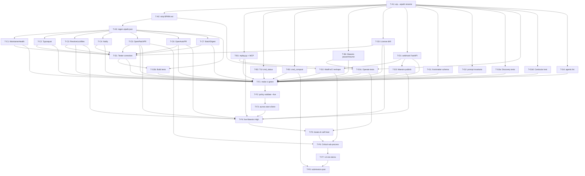

# tasks.md — AURORA final-mile work breakdown

Decomposed from `PDD.md` on 2026-05-09. Each task is a vertical slice (scaffolding + implementation + tests + docs in one PR), targets ≤ 500 LOC, names files/modules/agents touched, lists `blocks:` / `blocked-by:`, and cites the user-story IDs from `PDD.md` it satisfies.

**Conventions:**
- ID prefix encodes workstream (A-G).
- `[parallel-safe]` tasks within the same workstream may run concurrently in separate worktrees.
- `[serial]` tasks block their workstream until they merge.
- **Model tier** maps to `policy.yaml::routing.bindings` — `high_stakes` (Opus), `mid_stakes` (Sonnet), `continuous` (Haiku). Codex/GLM/DeepSeek lanes are picked by the Conductor for parallel coding fan-out within mid_stakes.
- Acceptance criteria always includes a failing test path that the task makes green.

---

## Workstream A — Foundation cleanup (serial gate)

Everything else blocks on A. Three tasks; none parallel-safe with each other.

### T-A1 — Rename `uip` → `uipath` across codebase

- **Type:** `[serial]`
- **Status:** `pending`
- **Files touched:** all `skills/*/SKILL.md`, all `agents/*.md`, `.claude/commands/*.md`, `Makefile`, `scripts/bootstrap.sh`, `docs/architecture.md`, `docs/submission-post.md`, `docs/demo-script.md`, `README.md`, `CLAUDE.md`, `policy.yaml`, `examples/oss-supply-chain-defender/break.sh`, `examples/oss-supply-chain-defender/restore.sh`, `examples/oss-supply-chain-defender/README.md`. **Excludes**: `examples/.../tests/Maestro/fixtures/*.json` (no CLI references there).
- **Model tier:** `continuous` (Haiku — pure rename).
- **Blocks:** T-A2, T-A3, T-B1, T-B2, T-B3, T-B4, T-C1..T-C8, T-D1..T-D3, T-G1..T-G4.
- **Blocked-by:** none.
- **Acceptance criteria:**
  - `tests/lint/test_no_fictional_uip_cli.py` (new) — fails before, passes after — greps the working tree for `\buip\b` outside this test file and asserts zero hits.
  - `make lint` green.
  - `grep -rn '\buip\b' .` returns no operational matches.
- **Satisfies:** US-16.

### T-A2 — Strip `<uipath:taskBinding>` from `process.bpmn`

- **Type:** `[serial]`
- **Status:** `pending`
- **Files touched:** `examples/oss-supply-chain-defender/process.bpmn`, `examples/oss-supply-chain-defender/bindings.json` (if any binding metadata not yet there moves into it), `examples/oss-supply-chain-defender/tests/Maestro/*.json` (update fixture paths if needed).
- **Model tier:** `mid_stakes` (Sonnet — careful BPMN surgery).
- **Blocks:** T-A3, T-D2.
- **Blocked-by:** T-A1.
- **Acceptance criteria:**
  - `tests/lint/test_bpmn_no_inline_taskbinding.py` (new) — fails before, passes after — parses every `.bpmn` under `examples/` and asserts no `<uipath:taskBinding>` element survives.
  - `tests/lint/test_bpmn_bindings_complete.py` (new) — every `<bpmn:serviceTask>`/`<bpmn:userTask>` id in `process.bpmn` has a matching key in `bindings.json`.
  - The 3 existing Maestro test cases under `tests/Maestro/` pass unchanged (or with mechanical fixture-path edits).
- **Satisfies:** US-5, US-28, US-43.

### T-A3 — Regenerate `uipath.json` per agent/coded-workflow via `uipath init`

- **Type:** `[serial]`
- **Status:** `pending`
- **Files touched:** `examples/oss-supply-chain-defender/agents/vuln-lookup/uipath.json` (regenerate); placeholder `uipath.json` files in any other agent/coded-workflow that exists post-A2.
- **Model tier:** `mid_stakes`.
- **Blocks:** T-C1, T-C2, T-C3, T-C4, T-C5, T-C6, T-C7.
- **Blocked-by:** T-A2.
- **Acceptance criteria:**
  - `tests/lint/test_uipath_json_schema.py` (new) — fails before, passes after — for every `uipath.json` under `examples/`, validates against the schema `uipath init` writes (capture once, freeze in `tests/schemas/uipath_json.schema.json`).
  - `uipath pack` (dry-run) succeeds for `agents/vuln-lookup/`.
- **Satisfies:** US-6, US-29.

---

## Workstream B — Live-integration plumbing (parallel after A)

All four tasks parallel-safe with each other after A merges. Each lands in `lib/aurora/`.

### T-B1 — Implement `lib/aurora/replay.py` + wire MCP tool `aurora_replay_instance`

- **Type:** `[parallel-safe]`
- **Status:** `pending`
- **Files touched:** `lib/aurora/replay.py` (new, ~250 LOC), `lib/aurora/mcp/server.py` (lines 195-201, replace stub), `lib/aurora/uipath_client.py` (add `MaestroService.start_instance`, `pull_instance_inputs` if absent), `tests/unit/test_replay.py` (new), `tests/integration/test_replay_live.py` (new, gated by `UIPATH_INTEGRATION=1`).
- **Model tier:** `mid_stakes`.
- **Blocks:** T-F4 (replay diagnostic before live run).
- **Blocked-by:** T-A1.
- **Acceptance criteria:**
  - `tests/unit/test_replay.py::test_replay_compares_paths` — fails before, passes after — synthetic instance fixture; assert `ReplayResult.same_path is True` and `same_end_event is True`.
  - `tests/unit/test_replay.py::test_replay_detects_divergence` — same fixture but mutated end-event; assert `same_end_event is False`.
  - MCP tool `aurora_replay_instance` returns `{"replay_result": {...}}`, never `{"stub": true}`.
- **Satisfies:** US-23 (Diagnostician dispatches replay), part of US-2.

### T-B2 — Textual TUI for `lib/aurora/cli.py:cmd_status`

- **Type:** `[parallel-safe]`
- **Status:** `pending`
- **Files touched:** `lib/aurora/cli.py` (lines 73-91, replace stub; preserve `--once` and `--json` paths), `lib/aurora/tui/app.py` (new), `lib/aurora/tui/widgets/event_tail.py` (new), `lib/aurora/tui/widgets/agent_grid.py` (new), `lib/aurora/tui/widgets/gates_pane.py` (new), `lib/aurora/tui/widgets/budget_meter.py` (new), `tests/unit/test_tui_widgets.py` (new), `pyproject.toml` (add `textual` dependency).
- **Model tier:** `mid_stakes`.
- **Blocks:** T-F3.
- **Blocked-by:** T-A1.
- **Acceptance criteria:**
  - `tests/unit/test_tui_widgets.py` — Textual snapshot tests for each of the four widgets, fails before, passes after.
  - `aurora status --once --json` continues to emit JSON unchanged.
  - `aurora status` (TTY) opens the TUI; smoke test asserts each widget renders without error.
- **Satisfies:** US-15.

### T-B3 — Real compost PR opener (`cmd_compost`) + MCP wiring

- **Type:** `[parallel-safe]`
- **Status:** `pending`
- **Files touched:** `lib/aurora/cli.py` (lines 158-161, replace stub), `lib/aurora/compost.py` (new, ~300 LOC), `lib/aurora/mcp/server.py` (lines 203-209, replace stub), `tests/unit/test_compost.py` (new), `tests/integration/test_compost_live_pr.py` (new, gated; opens PR against `compost-test` branch).
- **Model tier:** `high_stakes` (Opus — composes diffs against skill files; needs care).
- **Blocks:** T-F8 (compost PR is part of the demo flow).
- **Blocked-by:** T-A1.
- **Acceptance criteria:**
  - `tests/unit/test_compost.py::test_propose_skill_pr_clusters_correctly` — fails before, passes after — synthetic learnings JSONL with a 3-occurrence-2-project pattern; assert one PR proposed.
  - `tests/unit/test_compost.py::test_propose_skill_pr_routes_through_promote` — assert `aurora-promote` called with `kind: skill_compost_pr`.
  - `tests/unit/test_compost.py::test_no_auto_merge` — assert PR opened with `--no-merge` semantics; the gate is non-negotiable.
  - Integration test opens a real PR against a `compost-test` branch with `[compost]` prefix.
  - MCP tool `aurora_compost_dry_run` returns the candidate-clusters list, not `{"stub": true}`.
- **Satisfies:** US-13, US-32.

### T-B4 — Maestro instance pause/resume helpers in `uipath_client`

- **Type:** `[parallel-safe]`
- **Status:** `pending`
- **Files touched:** `lib/aurora/uipath_client.py` (add `MaestroService.pause_instance / resume_instance / retry_instance / move_instance / cancel_instance`), `tests/unit/test_uipath_client_maestro.py` (new), `tests/integration/test_maestro_live.py` (new, gated).
- **Model tier:** `mid_stakes`.
- **Blocks:** T-F5 (Surgeon resumes paused instance).
- **Blocked-by:** T-A1.
- **Acceptance criteria:**
  - Unit tests with recorded HTTP fixtures for each verb; fail before, pass after.
  - Integration test pauses + resumes a real test instance against the live tenant.
- **Satisfies:** US-26, part of US-2.

---

## Workstream C — Demo project completeness (parallel after A)

Eight tasks, all parallel-safe with each other after A. Each is a single Coded Workflow / Coded Agent / XAML.

### T-C1 — MaintainerHealth Coded Agent (OpenAI Agents framework)

- **Type:** `[parallel-safe]`
- **Status:** `pending`
- **Files touched:** `examples/oss-supply-chain-defender/agents/maintainer-health/` (new directory): `pyproject.toml`, `main.py`, `models.py`, `tools/scorecard.py`, `tools/commit_recency.py`, `prompts/triage.md`, `evals/triage_eval.json`, `uipath.json` (via `uipath init`); `tests/integration/test_maintainer_health.py` (new).
- **Model tier:** `mid_stakes`.
- **Blocks:** T-E1 (Tester needs the agent published), T-F4.
- **Blocked-by:** T-A3.
- **Acceptance criteria:**
  - `evals/triage_eval.json` — Output Evaluators (JSON Similarity for the deterministic shape; LLM Judge for the reasoning); fails before, passes after.
  - `uipath pack` succeeds in the agent dir.
  - Integration test invokes `main(input)` against a real package; asserts a non-stub `MaintainerHealthReport` shape.
- **Satisfies:** US-35, US-36.

### T-C2 — TyposquatCheck Coded Workflow (C#)

- **Type:** `[parallel-safe]`
- **Status:** `pending`
- **Files touched:** `examples/oss-supply-chain-defender/coded/Typosquat/` (new): `Typosquat.csproj`, `CheckLockfiles.cs`, `Levenshtein.cs` (pure helper), `AllowList.json`; `tests/coded/Typosquat.Tests/` (xUnit).
- **Model tier:** `mid_stakes`.
- **Blocks:** T-F4.
- **Blocked-by:** T-A3.
- **Acceptance criteria:**
  - `Levenshtein.Tests::TypicalSquats` — fails before, passes after — `lodaash` vs `lodash` distance ≤ 2 → flagged.
  - `CheckLockfiles.Tests::ReturnsExpectedSuspects` — input lockfile fixture, asserts the suspect list.
  - `dotnet build` green; `uipath pack` succeeds.
- **Satisfies:** US-37.

### T-C3 — ResolveLockfiles Coded Workflow (C#) — real GitHub enumeration

- **Type:** `[parallel-safe]`
- **Status:** `pending`
- **Files touched:** `examples/oss-supply-chain-defender/coded/ResolveLockfiles/` (new): `ResolveLockfiles.csproj`, `Resolve.cs`, `Parsers/NpmParser.cs`, `Parsers/PyPiParser.cs`, `Parsers/GoParser.cs`; `tests/coded/ResolveLockfiles.Tests/`.
- **Model tier:** `mid_stakes`.
- **Blocks:** T-F4 (FanOut feeds on this output).
- **Blocked-by:** T-A3.
- **Acceptance criteria:**
  - Per-parser unit tests — fixture lockfile in, expected `LockfileEntry[]` out — fail before, pass after.
  - `Resolve.Tests::EnumeratesScanScope` — mocked Octokit, asserts only repos matching `ScanScope` glob are returned.
  - Integration test against a real GitHub demo repo.
- **Satisfies:** US-33, US-34.

### T-C4 — Notify.SendDigest + Notify.AppendToDigest Coded Workflows

- **Type:** `[parallel-safe]`
- **Status:** `pending`
- **Files touched:** `examples/oss-supply-chain-defender/coded/Notify/` (new): `Notify.csproj`, `SendDigest.cs`, `AppendToDigest.cs`, `Models/DigestEntry.cs`; `tests/coded/Notify.Tests/`.
- **Model tier:** `mid_stakes`.
- **Blocks:** T-F4.
- **Blocked-by:** T-A3.
- **Acceptance criteria:**
  - Unit tests with mocked Slack client; fail before, pass after.
  - Integration test posts to a real Slack channel; asserts message ID returned.
- **Satisfies:** US-40.

### T-C5 — OpenPatchPR Coded Workflow

- **Type:** `[parallel-safe]`
- **Status:** `pending`
- **Files touched:** `examples/oss-supply-chain-defender/coded/OpenPatchPR/` (new): `OpenPatchPR.csproj`, `Open.cs`, `BumpHelper.cs`; `tests/coded/OpenPatchPR.Tests/`.
- **Model tier:** `mid_stakes`.
- **Blocks:** T-F6 (Critical sub-process opens this PR).
- **Blocked-by:** T-A3.
- **Acceptance criteria:**
  - Unit tests with mocked Octokit; assert PR title / branch / file diff shape.
  - Integration test opens a real PR in the demo org; asserts `pr_url` returned.
- **Satisfies:** US-39, US-11.

### T-C6 — OpenAutoPR Coded Workflow

- **Type:** `[parallel-safe]`
- **Status:** `pending`
- **Files touched:** `examples/oss-supply-chain-defender/coded/OpenAutoPR/` (new): `OpenAutoPR.csproj`, `Open.cs`; `tests/coded/OpenAutoPR.Tests/`.
- **Model tier:** `mid_stakes`.
- **Blocks:** T-F4 (High path opens this PR).
- **Blocked-by:** T-A3.
- **Acceptance criteria:**
  - Unit tests assert version-bump diff shape (semver minor for High, no major bumps).
  - Integration test opens a real PR.
- **Satisfies:** US-39.

### T-C7 — BatchDigest Coded Workflow

- **Type:** `[parallel-safe]`
- **Status:** `pending`
- **Files touched:** `examples/oss-supply-chain-defender/coded/BatchDigest/` (new): `BatchDigest.csproj`, `Batch.cs`; `tests/coded/BatchDigest.Tests/`.
- **Model tier:** `mid_stakes`.
- **Blocks:** none direct, but consumed by T-F4's End event.
- **Blocked-by:** T-A3.
- **Acceptance criteria:**
  - Unit test asserts weekly-digest aggregation shape.
  - Integration test runs end-to-end against the digest channel.
- **Satisfies:** US-40.

### T-C8 — CheckLicenseDrift.xaml — ClearlyDefined.io + GitHub Licenses fallback

- **Type:** `[parallel-safe]`
- **Status:** `pending`
- **Files touched:** `examples/oss-supply-chain-defender/workflows/License/CheckLicenseDrift.xaml` (replace placeholder HTTP), `examples/oss-supply-chain-defender/Config.xlsx` (add `LicenseCompat` sheet), `examples/oss-supply-chain-defender/.objects/license/` (selectors if any UI inspection); `tests/workflows/CheckLicenseDrift.Tests.xaml` (new).
- **Model tier:** `mid_stakes`.
- **Blocks:** T-F4.
- **Blocked-by:** T-A1 (skill rename).
- **Acceptance criteria:**
  - Test runs the workflow against a known npm package (e.g., `lodash` MIT) and asserts no drift.
  - Test runs against a synthetic conflict (declared MIT, transitive GPL) and asserts drift.
  - Test exercises the fallback path (ClearlyDefined returns 404 → GitHub Licenses).
- **Satisfies:** US-38.

---

## Workstream D — Maestro publish + WaitForCI (serial within itself; parallel-with-others after A)

### T-D1 — FastAPI webhook service `webhook/github-check-run/` + `cloudflared` docs

- **Type:** `[serial]`
- **Status:** `pending`
- **Files touched:** `webhook/github-check-run/` (new): `app.py`, `pyproject.toml`, `Dockerfile`, `tests/test_webhook.py` (FastAPI TestClient); `docs/webhook-deploy.md` (new); `policy.yaml` (add `webhook.github_check_run.url` entry).
- **Model tier:** `mid_stakes`.
- **Blocks:** T-D2, T-D3.
- **Blocked-by:** T-A1.
- **Acceptance criteria:**
  - `tests/test_webhook.py::test_good_signature` — signed payload returns 200; fails before, passes after.
  - `test_bad_signature` — 401.
  - `test_malformed_json` — 400.
  - `test_unexpected_event` — 204 (ignored).
  - `test_correlation_post` — asserts the Maestro instance message-receive endpoint is called with the expected body.
  - `docs/webhook-deploy.md` exists and includes `cloudflared tunnel create`, GitHub webhook config, secret rotation.
- **Satisfies:** US-42, US-47.

### T-D2 — WaitForCI BPMN reshape (Send Task + intermediate message catch)

- **Type:** `[serial]`
- **Status:** `pending`
- **Files touched:** `examples/oss-supply-chain-defender/process.bpmn` (replace `<bpmn:receiveTask id="WaitForCI">` with Send Task + intermediate message catch event + boundary timer), `examples/oss-supply-chain-defender/bindings.json` (update WaitForCI binding shape), `examples/oss-supply-chain-defender/tests/Maestro/*.json` (update fixture overrides if the message correlation key changed).
- **Model tier:** `mid_stakes`.
- **Blocks:** T-F6.
- **Blocked-by:** T-A2, T-D1.
- **Acceptance criteria:**
  - `tests/lint/test_bpmn_no_inline_taskbinding.py` still green.
  - New `tests/lint/test_waitforci_shape.py` asserts: a Send Task posting the pending comment, an intermediate message catch with `correlationKey="pr_url"`, a boundary timer with `timeDuration` set; **no** `<bpmn:receiveTask>` with id `WaitForCI`.
  - Fallback branch `feature/waitforci-usertask-fallback` exists with the User-Task-auto-completed-by-webhook variant; tagged with the resume command in commit message.
- **Satisfies:** US-41.

### T-D3 — Maestro publish bridge (Studio Web HTTP wrapper + Playwright UI fallback)

- **Type:** `[serial]`
- **Status:** `pending`
- **Files touched:** `lib/aurora/uipath_client.py` (add `MaestroService.publish_maestro_project`), `lib/aurora/playwright/capture.py` (new — used once to capture the publish HTTP call), `lib/aurora/playwright/publish_ui_fallback.py` (new — keeps the UI-drive variant warm), `tests/unit/test_maestro_publish.py` (recorded fixture), `tests/integration/test_maestro_publish_live.py` (gated, no-op publish against live tenant).
- **Model tier:** `high_stakes` (Opus — sensitive reverse-engineering, needs care).
- **Blocks:** T-F4, T-F8.
- **Blocked-by:** T-D1.
- **Acceptance criteria:**
  - `test_maestro_publish.py::test_publishes_with_recorded_fixture` — fails before, passes after.
  - Integration test publishes a no-op version bump to the test folder; asserts package version increments.
  - Fallback path covered by a separate test that explicitly drives the UI variant.
- **Satisfies:** US-9, US-2.

---

## Workstream E — Tester agent correction (after C)

### T-E1 — Tester emits Studio test packages, publishes via `uipath publish`, links in Test Manager

- **Type:** `[serial]`
- **Status:** `pending`
- **Files touched:** `agents/tester.md` (rewrite the flow — Studio → Orchestrator → Test Manager link), `lib/aurora/test_manager.py` (new — Test Manager API client + Playwright fallback), `tests/unit/test_test_manager.py`, `tests/integration/test_tester_live.py` (gated).
- **Model tier:** `mid_stakes`.
- **Blocks:** T-F1 (Tester is part of the merge gate).
- **Blocked-by:** T-C1, T-C2, T-C3, T-C4, T-C5, T-C6, T-C7, T-C8.
- **Acceptance criteria:**
  - Unit tests cover the Test Manager linkage call (API path; Playwright path).
  - Integration test publishes a tiny test package and links it in Test Manager.
  - `agents/tester.md` no longer claims "publishes test set to Test Manager via API" without the Studio→Orchestrator→link flow.
- **Satisfies:** US-27.

---

## Workstream G — Agent test buildout (parallel after A)

Four tasks, all parallel-safe with each other and with B/C/D. **Note on size:** T-G3 is split by fleet to keep PRs ≤ 500 LOC.

### T-G1 — Agent frontmatter schema + parametrised pytest

- **Type:** `[parallel-safe]`
- **Status:** `pending`
- **Files touched:** `tests/schemas/agent_frontmatter.schema.json` (new), `tests/agents/test_frontmatter.py` (parametrised over all 19 files).
- **Model tier:** `mid_stakes`.
- **Blocks:** T-F1.
- **Blocked-by:** T-A1.
- **Acceptance criteria:**
  - Schema has required keys: `name`, `description`, `tools`, `fleet`, `model_tier`.
  - All 19 agent files validate; test fails before (schema absent) and passes after.
- **Satisfies:** US-31.

### T-G2 — Prompt-body invariants pytest

- **Type:** `[parallel-safe]`
- **Status:** `pending`
- **Files touched:** `tests/agents/test_prompt_invariants.py`, `tests/agents/banned_patterns.py` (the regex set).
- **Model tier:** `mid_stakes`.
- **Blocks:** T-F1.
- **Blocked-by:** T-A1.
- **Acceptance criteria:**
  - Test suite parametrised over all 19 agent files asserts:
    1. No `ANTHROPIC_API_KEY` reference;
    2. Cited skills exist on disk under `skills/` or in the official-UiPath skill list;
    3. Cited sibling agents exist;
    4. No claim contradicted in `.aurora/grill-2026-05-09.md` (no `uip` CLI binary, no `<uipath:taskBinding>` reference, no "publish to Test Manager via API" wording);
    5. For Build agents, the right skill from the picker matrix is named.
  - All assertions fail before fixes, pass after the agent definitions are corrected.
- **Satisfies:** US-17, US-19.

### T-G3a — Functional contract tests: Discovery fleet (5 agents)

- **Type:** `[parallel-safe]`
- **Status:** `pending`
- **Files touched:** `tests/agents/test_scout.py`, `test_curator.py`, `test_analyst.py`, `test_interviewer.py`, `test_strategist.py`, `tests/agents/fixtures/scout/*.json`, `fixtures/curator/*.json`, etc.
- **Model tier:** `mid_stakes`.
- **Blocks:** T-F1.
- **Blocked-by:** T-A1.
- **Acceptance criteria:**
  - Each test invokes the agent via `Task(subagent_type="aurora:<name>", prompt=...)` against a recorded scenario fixture.
  - Asserts the structured artefact shape: Scout → friction-signal JSON; Curator → deduplicated backlog entry; Analyst → PDD with ambiguity score; Interviewer → ≤5 questions; Strategist → consolidation/deprecation proposal.
  - All five fail before fixtures wired, pass after.
- **Satisfies:** US-7, US-30, US-31; supports US-1..US-3.

### T-G3b — Functional contract tests: Build fleet (8 agents)

- **Type:** `[parallel-safe]`
- **Status:** `pending`
- **Files touched:** `tests/agents/test_architect.py`, `test_cartographer.py`, `test_forger_rpa.py`, `test_forger_coded.py`, `test_forger_agent.py`, `test_forger_maestro.py`, `test_reviewer.py`, `test_tester.py`, `tests/agents/fixtures/<each>/*.json`.
- **Model tier:** `mid_stakes`.
- **Blocks:** T-F1.
- **Blocked-by:** T-A1, T-A3 (forger-* tests need `uipath.json` schema), T-E1 (Tester contract finalised).
- **Acceptance criteria:**
  - Each test invokes the agent and asserts the contract: Architect → ADR with pattern selection; Cartographer → `references.json`; Forgers → emitted artefact paths; Reviewer → lint outcome; Tester → published-package URL + Test Manager link.
  - Forger-Maestro test asserts no `<uipath:taskBinding>` in emitted `.bpmn` and `bindings.json` populated.
- **Satisfies:** US-8, US-9, US-28, US-29, US-31; supports US-43.

### T-G3c — Functional contract tests: Operate fleet (5 agents)

- **Type:** `[parallel-safe]`
- **Status:** `pending`
- **Files touched:** `tests/agents/test_sentry.py`, `test_diagnostician.py`, `test_surgeon.py`, `test_auditor.py`, `test_concierge.py`, `tests/agents/fixtures/<each>/*.json`.
- **Model tier:** `mid_stakes`.
- **Blocks:** T-F5 (self-heal flow).
- **Blocked-by:** T-A1, T-B1 (replay), T-B4 (pause/resume).
- **Acceptance criteria:**
  - Sentry test runs the daemon for ≥ 30s against a recorded events fixture; asserts events emitted to `events.jsonl`.
  - Diagnostician test runs `aurora-fingerprint` and dispatches Surgeon when confidence ≥ 0.7; asserts dispatch contract.
  - Surgeon test spins a worktree, calls a Forger, opens a fixture PR.
  - Auditor test asserts drift detection on a known-mismatched package.
  - Concierge test creates and completes a Form Task against the live test catalog.
- **Satisfies:** US-20, US-21, US-22, US-23, US-24, US-25, US-26.

### T-G3d — Functional contract tests: Meta (Conductor)

- **Type:** `[parallel-safe]`
- **Status:** `pending`
- **Files touched:** `tests/agents/test_conductor.py`, `tests/agents/fixtures/conductor/*.json`.
- **Model tier:** `high_stakes` (Opus).
- **Blocks:** T-F1.
- **Blocked-by:** T-A1.
- **Acceptance criteria:**
  - Test invokes Conductor with a synthetic backlog + fleet state; asserts: (a) cross-fleet handoffs all routed through Conductor; (b) HITL gate enforced when triggered; (c) worktree allocation honours `policy.yaml` cap; (d) model-tier routing matches `policy.yaml::routing.bindings`.
- **Satisfies:** US-30.

### T-G4 — `tests/agents/test_all_agents_lint.py` (Reviewer-driven)

- **Type:** `[parallel-safe]`
- **Status:** `pending`
- **Files touched:** `tests/agents/test_all_agents_lint.py`.
- **Model tier:** `mid_stakes`.
- **Blocks:** T-F1.
- **Blocked-by:** T-A1.
- **Acceptance criteria:**
  - Test invokes the Reviewer agent over each agent definition file; asserts no error-level lint failures.
  - Fails before (Reviewer rules not yet codified for agents), passes after.
- **Satisfies:** US-31.

---

## Workstream F — End-to-end live integration (final, serial)

All eight tasks run sequentially. Cannot start until B + C + D + E + G all green.

### T-F1 — `make ci` green

- **Type:** `[serial]`
- **Status:** `pending`
- **Files touched:** Whatever fails ci (most likely lint nits, typecheck, fixture path edits).
- **Model tier:** `mid_stakes`.
- **Blocks:** T-F2.
- **Blocked-by:** T-B*, T-C*, T-D*, T-E1, T-G* (everything).
- **Acceptance criteria:**
  - `make ci` exits 0 on the integration branch.
- **Satisfies:** US-18.

### T-F2 — `aurora policy validate --strict --live` passes

- **Type:** `[serial]`
- **Status:** `pending`
- **Files touched:** `lib/aurora/policy.py` (extend `--live` to probe Orchestrator + GitHub), `tests/integration/test_policy_live.py`.
- **Model tier:** `mid_stakes`.
- **Blocks:** T-F3.
- **Blocked-by:** T-F1.
- **Acceptance criteria:**
  - `--live` mode hits Orchestrator `/odata/Folders`, GitHub `/repos/{org}` (HEAD), Action Center catalog endpoint; reports drift per env var.
  - Test fails before live probes wired, passes after.
- **Satisfies:** US-14.

### T-F3 — `aurora start` runs ≥ 5 minutes clean

- **Type:** `[serial]`
- **Status:** `pending`
- **Files touched:** Whatever surfaces in 5 minutes of daemon runtime.
- **Model tier:** `mid_stakes`.
- **Blocks:** T-F4.
- **Blocked-by:** T-F2.
- **Acceptance criteria:**
  - All 19 agents come online (visible in TUI).
  - Sentry / Auditor schedule / Strategist nightly cron all start.
  - 5-minute log review shows no `ERROR` level entries.
- **Satisfies:** US-1.

### T-F4 — Live Maestro run through the High path opens a real GitHub PR

- **Type:** `[serial]`
- **Status:** `pending`
- **Files touched:** Possibly `examples/oss-supply-chain-defender/Config.xlsx` (URL/asset tweaks), runtime fixes.
- **Model tier:** `mid_stakes`.
- **Blocks:** T-F5.
- **Blocked-by:** T-F3, T-D3 (publish bridge), T-C3, T-C5, T-C6, T-C8, T-B1.
- **Acceptance criteria:**
  - Manual Maestro instance start completes through the High path.
  - A real PR is opened in the demo GitHub org by `OpenAutoPR`.
  - End event emits to Insights.
- **Satisfies:** US-11, US-39.

### T-F5 — `break.sh` triggers self-heal in < 60 s

- **Type:** `[serial]`
- **Status:** `pending`
- **Files touched:** Possibly Surgeon's remediation logic; Sentry polling tuning.
- **Model tier:** `high_stakes` (Opus — diagnose timing tightly).
- **Blocks:** T-F6.
- **Blocked-by:** T-F4, T-G3c (Operate fleet tests).
- **Acceptance criteria:**
  - `./examples/oss-supply-chain-defender/break.sh` injects invalid `GITHUB_TOKEN`.
  - Sentry emits `kind: auth_failed` within 60s.
  - Diagnostician fingerprints with confidence ≥ 0.7.
  - Surgeon rotates Asset, resumes Maestro instance.
  - Run completes green within 120s of `break.sh`.
- **Satisfies:** US-12, US-22, US-23, US-24, US-25, US-26.

### T-F6 — Critical sub-process flows end-to-end with real Action Center + merge

- **Type:** `[serial]`
- **Status:** `pending`
- **Files touched:** Possibly Concierge + Action Center catalog seed.
- **Model tier:** `mid_stakes`.
- **Blocks:** T-F7.
- **Blocked-by:** T-F5, T-D2, T-C5.
- **Acceptance criteria:**
  - Critical finding triggers `CriticalSubProcess`.
  - Action Center Form Task created in `aurora_supply_chain_approvals` catalog.
  - Human approves via the form (real interaction).
  - `OpenPatchPR` opens the PR; CI green; DMN routes to auto-merge.
  - PR merged in the demo org.
- **Satisfies:** US-10, US-11, US-20.

### T-F7 — Run the 12-minute demo from beat 0:00 to 12:00

- **Type:** `[serial]`
- **Status:** `pending`
- **Files touched:** None expected (verification step). Updates `docs/demo-script.md` if any beat needs re-timing.
- **Model tier:** `high_stakes` (final dress rehearsal — Opus oversight).
- **Blocks:** T-F8.
- **Blocked-by:** T-F6.
- **Acceptance criteria:**
  - Each of the 12 beats lands within ±15s of the script timing.
  - Two human approvals fire (prod_publish at 7:00, emergency_patch at 8:00) — and only those.
  - Compost-step PR appears at 11:30.
  - Strategist proposal + Auditor cross-folder check at 10:30.
- **Satisfies:** US-3, US-7, US-8, US-9, US-10, US-11, US-12, US-13, US-46.

### T-F8 — Update `docs/submission-post.md` to reflect what shipped

- **Type:** `[serial]`
- **Status:** `pending`
- **Files touched:** `docs/submission-post.md`, optionally `README.md`.
- **Model tier:** `mid_stakes`.
- **Blocks:** none (final).
- **Blocked-by:** T-F7.
- **Acceptance criteria:**
  - Every feature claim in submission-post.md maps to a shipped artifact verified by `make ci`.
  - New "Final mile changes" sub-section captures D1-D7 + the CLI rename + the Tester flow correction.
  - `tests/docs/test_submission_claims.py` (new) — parses the post's claim list and asserts each maps to an existing test path.
- **Satisfies:** US-4, US-44, US-45.

---

## PR-size flags

These tasks are at risk of exceeding 500 LOC and may need a split:

- **T-D3** (Maestro publish bridge) — Playwright capture + headless wrapper + UI fallback could exceed. **Proposed split:** D3a (capture + wrapper), D3b (UI fallback) if D3a alone hits 450 LOC.
- **T-G3b** (Build fleet, 8 agents × ~50-80 LOC each) — could exceed. **Proposed split:** G3b-i (architect, cartographer, reviewer, tester) and G3b-ii (4 forgers).
- **T-F5** (self-heal) — depending on remediation timing fixes. **Proposed split:** F5a (Sentry detection ≤ 60s), F5b (Surgeon resume).

Apply splits only if a task's first PR draft actually hits the cap; don't pre-split.

---

## Dependency graph

---

## Summary

- **24 tasks** total: 3 in A, 4 in B, 8 in C, 3 in D, 1 in E, 8 in F, 7 in G (counting G3a/b/c/d as separate).
- **Critical path:** A1 → A2 → D1 → D2 → … → F1 → F2 → F3 → F4 → F5 → F6 → F7 → F8.
- **Parallel-safe count:** 16 tasks across B/C/G can run in parallel after A.
- **Worktree concurrency cap:** 4 (per `policy.yaml::worktree_pool.max_concurrent`). Conductor schedules within this cap.
- **Estimated wall-clock to F8** (with 4-way parallelism and the 6-day deadline): days 1-2 cover A; days 2-4 cover B+C+D+G in parallel; day 4-5 covers E + F1-F3; day 5-6 covers F4-F8.
